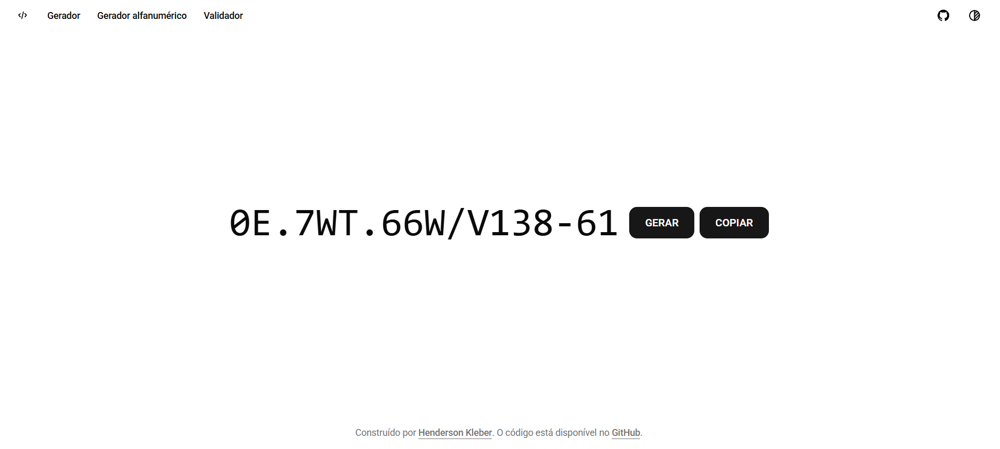

# 🏢 Gerador e Validador de CNPJ - Angular

Projeto em Angular para geração e validação de **CNPJs** com três funcionalidades principais:

- 🔢 **CNPJ Numérico**
- 🔠 **CNPJ Alfanumérico**
- ✅ **Validador de CNPJ**



## 🚀 Funcionalidades

### 📌 CNPJ Numérico

Gera CNPJs válidos com 14 dígitos numéricos, conforme o algoritmo da Receita Federal.

### 🔐 CNPJ Alfanumérico

Gera CNPJs válidos com 12 caracteres alfanuméricos e 2 dígitos numéricos, conforme o algoritmo da Receita Federal, válido a partir de 2026.

### ✅ Validador de CNPJ

Permite ao usuário digitar um CNPJ e verificar se ele é válido.

## 🛠️ Tecnologias Utilizadas

- [Angular](https://angular.io/) 16+
- TypeScript
- SCSS
- RxJS

## ▶️ Como Usar

### 1. Clone o repositório

```bash
git clone https://github.com/hendersonkleber/gerador-cnpj.git
cd gerador-cnpj
```

### 2. Instale as dependências

```bash
npm install
```

### 3. Rode o projeto localmente

```bash
ng serve
```

Acesse em: [http://localhost:4200](http://localhost:4200)

## 📷 Screenshot

A imagem de preview da aplicação está disponível em:  
`.github/screenshot.png`

---

## 📝 Licença

Este projeto está sob a licença MIT. Veja o arquivo [LICENSE](LICENSE) para mais detalhes.

---

Feito com 💙 por [Henderson Kleber](https://github.com/hendersonkleber)
